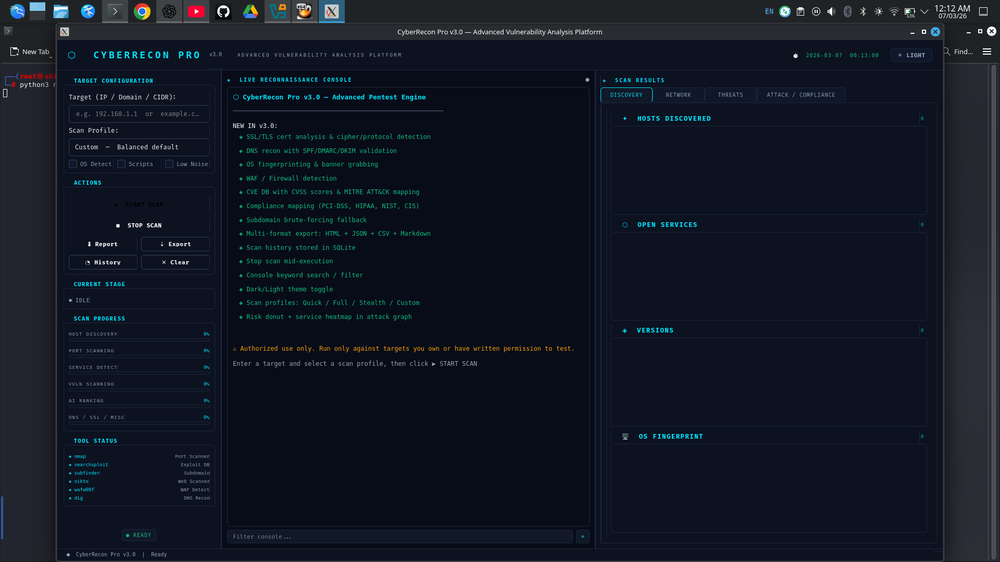
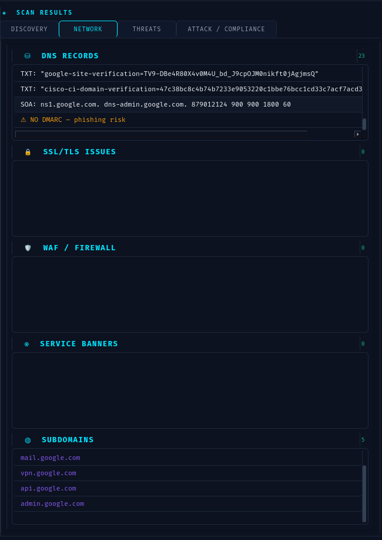
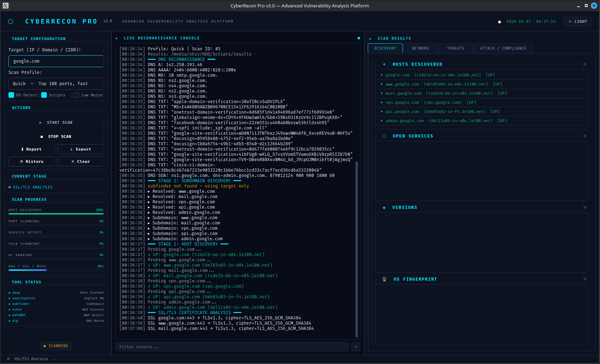

# 🛡️ CyberRecon Pro v3.0

CyberRecon Pro is an **Advanced Cybersecurity Reconnaissance & Vulnerability Assessment Platform** built using **Python and PyQt5**.

It automates reconnaissance, service discovery, vulnerability intelligence, and attack-path visualization used in **penetration testing and red-team engagements**.

---

# 🚀 Features

## 🔎 Reconnaissance

* Multi-target batch scanning
* Subdomain discovery
* DNS reconnaissance (MX, TXT, NS, SPF, DMARC)
* Host discovery
* OS fingerprinting

## 🌐 Network & Service Scanning

* Nmap-based port scanning
* Service and version detection
* Banner grabbing
* Network topology discovery

## 🔐 Security Analysis

* SSL/TLS certificate analysis
* Weak cipher detection
* Firewall / WAF detection
* Password policy checks

## 🧠 Vulnerability Intelligence

* CVE database integration
* CVSS scoring
* MITRE ATT&CK technique tagging
* Exploit suggestions

## 📊 Visualization

* Risk heatmap dashboard
* Attack path generation
* Network attack graph visualization
* Scan timeline

## 📑 Reporting

Export results in multiple formats:

* HTML
* JSON
* CSV
* Markdown

## 🏛 Compliance Mapping

Security compliance checks for:

* PCI-DSS
* HIPAA
* NIST
* CIS

---

# 🖥️ Demo Video

You can embed a demo video of the tool running.

Example:

```
https://github.com/user-attachments/assets/demo-video.mp4
```

Or use YouTube:

```
https://www.youtube.com/watch?v=YOUR_VIDEO_ID
```

---

# 📸 Screenshots

### Dashboard



### Scan Results



### Working Dashboard



### Attack Graph Visualization


---

# 🛠️ Technologies Used

| Technology | Purpose                    |
| ---------- | -------------------------- |
| Python     | Core programming language  |
| PyQt5      | GUI framework              |
| Nmap       | Network scanning           |
| Nikto      | Web vulnerability scanning |
| NetworkX   | Attack graph visualization |
| Matplotlib | Data visualization         |
| SQLite     | Scan history database      |

---

# ⚙️ Installation

Clone the repository:

```bash
git clone https://github.com/Shivam-Sh-9027/CyberRecon-Pro.git
cd CyberRecon-Pro
```

Install Python dependencies:

```bash
pip install -r requirements.txt
```

---

# 🔧 System Requirements (External Tools)

CyberRecon Pro depends on several external security tools.
These tools must be installed manually because they are **not included in `requirements.txt`**.

Install required tools:

```bash
sudo apt update
sudo apt install nmap nikto exploitdb dnsutils curl git python3-pip -y
```

This installs:

| Tool           | Purpose                             |
| -------------- | ----------------------------------- |
| Nmap           | Port scanning and service detection |
| Nikto          | Web vulnerability scanning          |
| Searchsploit   | Exploit database lookup             |
| Dig / nslookup | DNS reconnaissance                  |
| Curl           | Banner grabbing                     |

---

## Install WAF Detection Tool

```bash
pip install wafw00f
```

Used for detecting **Web Application Firewalls**.

---

## Install Subdomain Enumeration Tool

```bash
go install github.com/projectdiscovery/subfinder/v2/cmd/subfinder@latest
```

Add Go binary path:

```bash
export PATH=$PATH:~/go/bin
```

---

# 🔍 Verify Installation

Run these commands to verify the installation:

```bash
nmap --version
nikto -Version
searchsploit -h
dig google.com
curl --version
wafw00f --help
subfinder -h
```

---

# ▶️ Running CyberRecon Pro

Start the application:

```bash
python3 cyberrecon_pro.py
```

If network permissions are required:

```bash
sudo python3 cyberrecon_pro.py
```

---

# 📂 Project Structure

```
CyberRecon-Pro
│
├── cyberrecon_pro.py
├── requirements.txt
├── README.md
│
├── Screenshots
│   ├── dashboard.png
│   ├── scan_results.png
│   ├── working_dashboard.png
│   └── attack_graph_v3.png
│
└── results
```

---

# 📊 Output

Scan results are stored in the **results** directory.

Possible files generated:

```
results/
cyberrecon.db
nmap_scan.xml
scan_reports
exported_results
```

---

# ⚠️ Disclaimer

This project is intended **for educational purposes and authorized security testing only**.

Do **NOT scan networks without permission**.

The developer is **not responsible for misuse of this tool**.

---

# 👨‍💻 Author

**Shivam Sharma**

Cybersecurity Enthusiast
Penetration Testing | Security Research | Red Teaming

GitHub:

```
https://github.com/Shivam-Sh-9027
```

---

# ⭐ Support

If you like this project:

⭐ Star the repository
🍴 Fork the project
📢 Share it with the cybersecurity community
